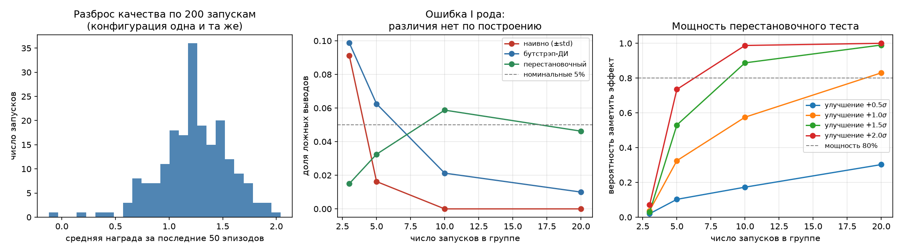

# Насколько можно верить сравнению RL-алгоритмов по трём запускам

## Вопрос

В работах по обучению с подкреплением результаты часто отчитываются по 3–5 запускам: «среднее ± стандартное отклонение, наш метод выше — значит, лучше». Обучение при этом стохастично, и разброс между запусками одной конфигурации бывает велик. Отсюда два вопроса:

1. Как часто такая процедура объявляет различие там, где его нет? (ошибка I рода)
2. Насколько большое улучшение она вообще способна заметить? (мощность)

## Метод

Табличный Q-learning на gridworld 5×5 с шумными переходами. Метрика запуска — средняя награда за последние 50 эпизодов. Обучаются **200 запусков одной и той же конфигурации**: различий между ними нет по построению, варьируется только зерно генератора.

Из пула случайно выбираются две непересекающиеся группы по `g` запусков и сравниваются тремя способами:

- **наивно** — непересекающиеся интервалы «среднее ± std» (не тест: заявленного уровня значимости у него нет);
- **бутстрэп** — непересекающиеся 95 % бутстрэп-интервалы средних;
- **перестановочный тест**, α = 0.05 — корректная опорная процедура. Выбран вместо t-теста: не требует scipy, не опирается на нормальность и держит заявленные 5 % по построению.

Для оценки **мощности** ко второй группе добавляется сдвиг известного размера, выраженный в единицах разброса между запусками σ. Это сценарий, в котором новый метод действительно лучше старого на фиксированную величину.

Табличная задача выбрана намеренно. Вопрос требует точного знания истины и контроля над источниками шума; в глубоком RL шум приходит из нескольких мест сразу, и разделить вклады нельзя.

## Результаты

Разброс качества по 200 запускам: среднее 1.24, σ = 0.32, размах [−0.12, 2.04] — то есть **6.6 σ между худшим и лучшим запуском одной и той же конфигурации**.

### Ошибка I рода: различия нет по построению

| Запусков в группе | Наивно (±std) | Бутстрэп-ДИ | Перестановочный |
|---|---|---|---|
| 3 | 9.1 % | 9.9 % | 1.5 % |
| 5 | 1.6 % | 6.2 % | 3.2 % |
| 10 | 0.0 % | 2.1 % | 5.9 % |
| 20 | 0.0 % | 1.0 % | 4.6 % |

### Мощность перестановочного теста

| Запусков в группе | +0.5 σ | +1.0 σ | +1.5 σ | +2.0 σ |
|---|---|---|---|---|
| 3 | 2.0 % | 3.8 % | 3.0 % | 7.0 % |
| 5 | 10.2 % | 32.5 % | 53.0 % | 73.5 % |
| 10 | 17.2 % | 57.5 % | 88.8 % | 98.8 % |
| 20 | 30.2 % | 83.0 % | 99.0 % | 100 % |



## Выводы

**1. При трёх запусках наивное сравнение ошибается примерно в 9 % случаев.** Различия нет по построению, но интервалы «среднее ± std» расходятся почти в каждом одиннадцатом сравнении.

**2. У наивной процедуры нет контролируемой вероятности ошибки.** С ростом числа запусков средние концентрируются, а стандартное отклонение выборки — нет, поэтому доля срабатываний падает до нуля. Процедура не сходится ни к какому уровню значимости: при малых выборках она находит различия слишком легко, при больших перестаёт находить даже настоящие.

**3. При трёх запусках на группу корректный тест не может объявить различие значимым ни при каком размере эффекта.** Перестановочный тест дискретен: всего C(6,3) = 20 способов раскидать шесть запусков по двум группам, наблюдаемое разбиение и зеркальное к нему дают одинаковую |разность средних|, поэтому минимально достижимое p-значение равно 2/20 = 0.1 > 0.05.

**4. Сколько запусков нужно для мощности 80 %:**

| Размер улучшения | Запусков на группу |
|---|---|
| +0.5 σ | больше 20 |
| +1.0 σ | 20 |
| +1.5 σ | 10 |
| +2.0 σ | 10 |

При σ = 0.32 и среднем 1.24 улучшение на 1 σ — это примерно 26 % относительного прироста. То есть **чтобы надёжно подтвердить прирост в четверть, нужно 20 запусков на конфигурацию**, а улучшения меньше пятой части σ на таком бюджете практически неразличимы.

## Ограничения

- Замерена доля ложных выводов конкретных процедур на конкретной задаче, а не «частота ошибок в литературе по RL».
- Табличная задача с одним источником стохастичности. В глубоком RL добавляются инициализация сети, порядок данных, недетерминизм GPU — разброс, скорее всего, окажется больше, но здесь это не проверялось.
- Модель эффекта — сдвиг распределения целиком без изменения формы. Метод, который только уменьшает разброс между запусками, такой моделью не описывается.
- Бутстрэп-критерий «непересекающиеся ДИ» заведомо консервативен: непересечение интервалов — более сильное требование, чем значимое различие. Сравнивать его с перестановочным тестом по доле срабатываний нужно с этой поправкой.

## Как воспроизвести

```bash
pip install numpy matplotlib
python seed_study.py
```
